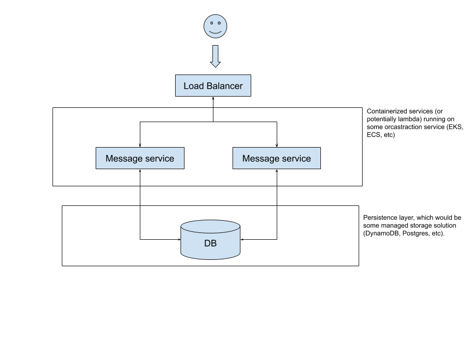

In this section, I'll try my best to encapsulate my thought process for digesting and formulating a solution to the interview problem. 

On first pass, I noted a few key requirements. Namely, that messages can be looked up by sender, and the ability to look up in the past 30 days. This information means that our data schema needs at minimum: `userId`, `messageId` (both UUID's), `message_text` and a `timestamp`. A sample api contract might look like:
```
{
    messages:[
        {
            senderId: int, // userId
            recieverId: int,
            message: string,
            timestamp: DateTime
        }
    ],
    limit: int,
    offset: int // for pagination
}
```

After jotting down the minimum requirements to achieve the feature request, I've gone ahead and created some simple API documentation that will be used when creating the service:


## POST: `v1/:userId/message`
A service to send a message to another user. </br>
Request:
```
{
    recieverId: userId,
    message: string,
    timestamp: dateTime

}
```

Response:
```
{} // 200

// could potentially return the newly created message, but given we're not going to be doing anything with the messageId at the moment, I think a 200 is sufficient
```
---

## GET: `v1/:userId/message?`
A service endpoint to return messages from either a specific user, or all messages for the requestor within a given time period. </br>
Request:
```
// Query parameters

?recipientId: Int,

?limit: Int,

?offset: Int,

?startTime: DateTime,

?endTime: DateTime
```
I've purposefully made this endpoint a little more generic and allowed the client to set the start / end time & limit. This still holds true to the requirements, but allows for others to more easily consume this endpoint for their needs. Mobile might limit to 10 messages to reduce over the wire size, support might need to be able to get all messages for a user from the past year, etc. 

Response:
```
{
    messages:[
        {
            senderId: int, // userId
            recieverId: int,
            message: string,
            timestamp: DateTime
        }
    ],
    limit: int,
    offset: int 
}
```
<br />

# System design

Now that a rough contract has been sketched out, it's time to start thinking about implementation. In complete honesty, this part has caused me the most trouble. I've thought of at least 3 different architectural designs that could be used to implement this, each with their own trade offs. After thinking about it for a while, I decided to follow the advice of my undergraduate professor "premature optimization is the root of all evil", and stick with a simple architecture to solve the problem, and if needed (hypothetically) the system could be modified for future business needs. 

For the initial implementation, this is the architecture I've come up with: 


It's simple, but allows for flexibility if needed (event bus for notification triggering, analytics processing, bounded context for better composition, etc). 

**Note**: this is a deployment architecture, and for the sake of simplicity, I won't actually be deploying this anywhere. The services and data bases will live in their own docker containers, but no load balancer will be implemented. 

</br>

# Requirement breakdown
With the API's and system design sketched out, the final step is to break down the work (usually into tickets) and get to work. Below are a list of requirements for this project:

* [ ] Set up Docker DB 
* [ ] Create DB Schema
* [ ] Set up Ruby Docker container
* [ ] Message creation service
* [ ] Message retrieval service
* [ ] Unit tests
* [ ] DB Seed script
* [ ] documentation
